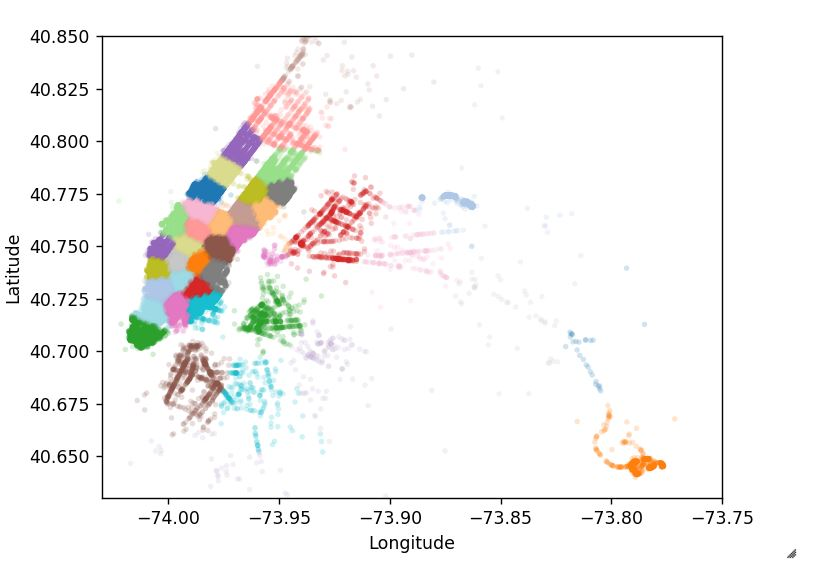

# New York City Taxi Demand Prediction

This project involves building a predictive model to forecast taxi demand in New York City. Through this analysis, I explored patterns in taxi trip data, applied machine learning techniques, and developed a model to assist in predicting high-demand times and locations.
  

## Table of Contents
- [Project Overview](#project-overview)
- [Objectives and Goals](#objectives-and-goals)
- [Dataset and Tools](#dataset-and-tools)
- [Implementation and Key Steps](#implementation-and-key-steps)
- [Results and Visualizations](#results-and-visualizations)
- [Learnings and Insights](#learnings-and-insights)
- [How to Run the Project](#how-to-run-the-project)
- [Future Work or Improvements](#future-work-or-improvements)

## Project Overview
This project uses historical NYC taxi trip data to predict future taxi demand. Accurate demand prediction can help taxi companies optimize resources, reduce wait times, and improve service quality.

## Objectives and Goals
The primary objectives of this project were:
1. **Analyze** historical taxi data to uncover demand patterns.
2. **Build predictive models** to forecast demand based on key features.
3. **Provide visualizations** to make data-driven insights accessible.

## Dataset and Tools
- **Dataset**: NYC Taxi and Limousine Commission (TLC) data, which includes trip details, timestamps, and location information.
- **Libraries**: `pandas`, `numpy`, `scikit-learn`, `matplotlib`, `seaborn`, `xgboost`, and `dask`.
- **Tools**: Jupyter Notebook, Google Colab, or any Python environment for code execution.

## Implementation and Key Steps
### 1. Data Preprocessing
   - Loaded and cleaned the dataset, handling missing values and filtering for relevant columns.
   - Extracted date and time features, such as day of the week and hour, to better capture temporal patterns in demand.

### 2. Exploratory Data Analysis (EDA)
   - **Temporal Analysis**: Analyzed demand across different times of day and days of the week.
   - **Geospatial Analysis**: Mapped demand across NYC neighborhoods.
   - **Visualization**: Created time series plots and heatmaps to reveal demand patterns.

### 3. Feature Engineering
   - Added new features, including weather conditions, public holidays, and location-based factors.
   - Scaled features to prepare the dataset for modeling.

### 4. Model Building and Evaluation
   - **Models Used**: Linear regression, decision trees, and XGBoost for their effectiveness in time series and demand prediction.
   - **Evaluation**: Used RMSE and MAE to evaluate model accuracy and ensure predictions align with actual demand.

## Results and Visualizations
- Temporal analysis highlighted peak demand hours in the late evening and early morning.
- Geospatial visualizations identified high-demand neighborhoods, indicating areas of focus for resource allocation.

    
   
    
  *(Add sample visuals if available)*

## Learnings and Insights
This project presented several machine learning and data processing challenges, which I addressed using specific techniques:

- **Handling Large Datasets**: Each month of data was approximately 1.5 GB, making it challenging to load the entire dataset into memory with limited RAM. To overcome this, I utilized the **Dask** library, which allowed me to process large datasets efficiently by breaking them into manageable chunks and parallelizing computations.

- **Capturing Temporal Patterns**: Predicting demand required an understanding of temporal patterns, but high variability across hours and days added complexity. I engineered time-based features, such as day of the week and hour, which helped the model capture these temporal trends effectively.

- **Sparse and Noisy Data**: Some locations and times had very low demand, leading to sparsity and noise. I tackled this by aggregating data over higher-demand areas and using smoothing techniques to reduce noise and improve prediction stability.

- **Feature Engineering and Selection**: Adding external features like weather and public holidays was essential to improving accuracy. I carefully engineered these features based on domain knowledge to ensure their relevance to taxi demand.

- **Overfitting in Complex Models**: With models like XGBoost, overfitting was a risk due to the dataset’s temporal and spatial intricacies. I used cross-validation and regularization techniques, tuning parameters like `max_depth` and `min_child_weight`, to improve generalization on new data.

These challenges provided valuable insights into working with large, real-world datasets and building models that can adapt to complex temporal and spatial patterns.

## How to Run the Project
To run this project locally:
1. Clone the repository: `git clone [repository link]`
2. Install dependencies:
   ```bash
   pip install -r requirements.txt
   ```
3. Open the Jupyter notebook and run each cell in sequence to see the analysis and predictions.

## Future Work or Improvements
- **Enhanced Feature Engineering**: Incorporating more granular weather and event data.
- **Real-Time Prediction**: Adapting the model for real-time prediction to provide instant demand forecasts.
- **Model Optimization**: Experimenting with more complex models like LSTM for time series forecasting.
